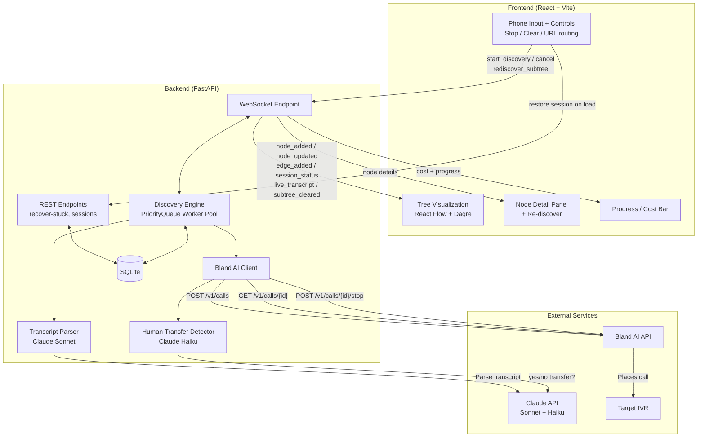
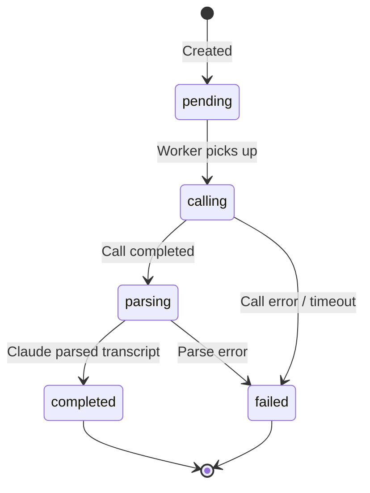
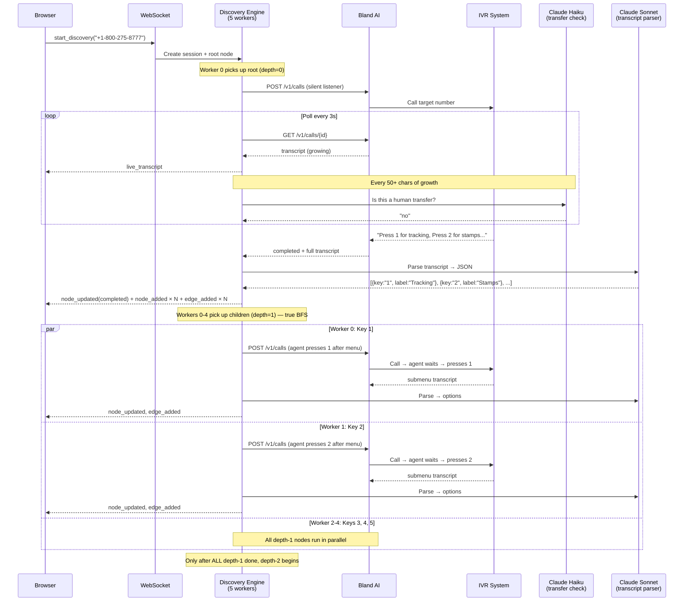
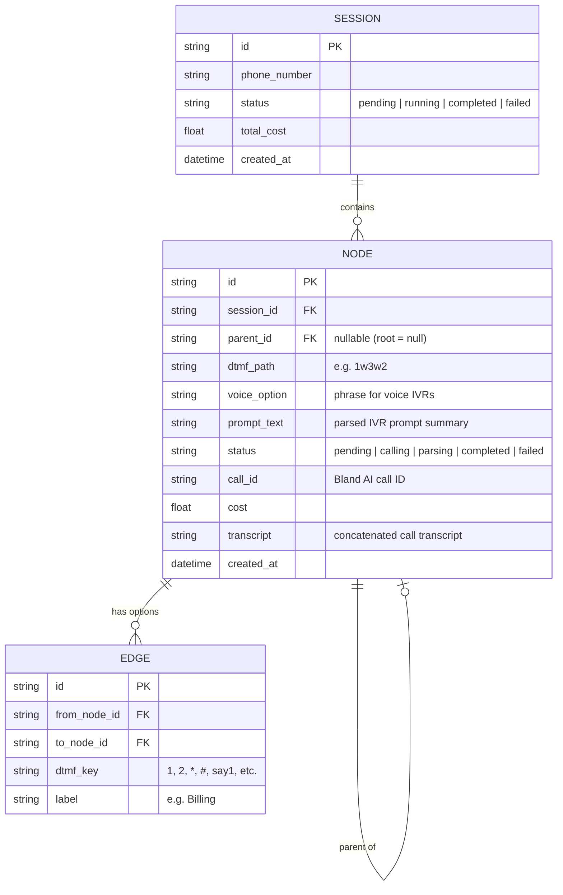

# IVR Tree Discovery — Architecture

## System Overview



## How Discovery Works

### Call Placement Strategy

There are three types of calls, each with a different AI agent behavior:

1. **Root call** — Agent stays completely silent. IVRs read their full menu after a pause. If the IVR asks an open-ended question ("What can I help you with?"), the agent says "What are my options?" exactly once, then goes silent forever.

2. **DTMF branch call (depth 1)** — Agent listens to the full menu, then presses the target key (e.g. `3`). No `precall_dtmf_sequence` — the agent intelligently waits for the right moment. After pressing, goes silent to hear the submenu.

3. **DTMF branch call (depth 2+)** — Compound path like `"1w3"`. The prefix keys (`"1"`) are sent via `precall_dtmf_sequence` (with wait padding), and the agent presses the last key (`"3"`) after hearing the submenu. This is a hybrid: automated navigation for known path + intelligent timing for the final key.

4. **Voice branch call** — For conversational IVRs with no DTMF keys (e.g. "say billing"). Agent speaks the exact option phrase, then goes silent.

### Worker Pool + BFS

The discovery engine uses a **PriorityQueue worker pool** — 5 concurrent workers pulling from a priority queue keyed by depth. This ensures true breadth-first exploration: all depth-1 nodes are explored before any depth-2 nodes, regardless of which worker finishes first.

```
PriorityQueue: (depth=0, root) → (depth=1, child1) → (depth=1, child2) → ... → (depth=2, grandchild1)
                                  ↑ always dequeued before depth-2 nodes
```

### Per-Node Lifecycle



Each node goes through: **pending → calling → parsing → completed/failed**. The frontend renders each state with distinct styling (gray → yellow pulse → green/red).

### Full Sequence



## Cycle Detection

Menus are fingerprinted by extracting the **core label** (stripping parenthetical descriptions) and building a `frozenset`:

```
"Package (track status, delivery issues)" → "package"
"Mail (daily services, pickup)"           → "mail"
Fingerprint: frozenset({"package", "mail", "tools", "stamps"})
```

Detection uses **Jaccard similarity** (threshold 0.6) against all previously seen menus. This catches cases where Claude paraphrases the same IVR menu differently across calls — e.g. one call returns 4 options, another returns 6, but they share 4 core labels (Jaccard = 4/6 = 0.67 > 0.6 → cycle).

## Human Transfer Detection

**Dual-layer approach** — fast real-time detection + thorough post-call analysis:

1. **During polling** (real-time): Every time the transcript grows by 50+ chars, Claude Haiku (~200ms) analyzes the last 500 chars. If a real human has picked up or the IVR explicitly transfers to a representative → `stop_call()` immediately. Distinguishes actual transfers ("transferring you to a representative") from timeout fallbacks ("please wait while we connect your call").

2. **After parsing** (post-call): Claude Sonnet's transcript parser sets `human_transfer: true` if it detects a live agent answered. Catches subtler cases.

After early termination for human transfer, the transcript is **still parsed** — any menu options read before the transfer are extracted and child nodes are created.

## Stale Call Detection

If the transcript hasn't grown for 5 consecutive polls (~15s), the call is stopped. This handles IVRs that hang up without changing the Bland AI call status to "completed".

## Data Model



## WebSocket Protocol

A single WebSocket connection handles both commands and updates:

| Direction | Message | Purpose |
|-----------|---------|---------|
| Client → Server | `start_discovery` | Begin exploring a phone number |
| Client → Server | `cancel` | Stop current discovery |
| Client → Server | `rediscover_subtree` | Re-explore a node and its children |
| Client → Server | `ping` | Keep-alive |
| Server → Client | `node_added` | New node created (pending) |
| Server → Client | `node_updated` | Status, cost, prompt, or call_id changed |
| Server → Client | `edge_added` | Menu option discovered |
| Server → Client | `session_status` | Progress, total cost, node counts |
| Server → Client | `live_transcript` | Partial transcript while call is active |
| Server → Client | `subtree_cleared` | Children deleted for re-discovery |
| Server → Client | `error` | Error message |

## REST Endpoints

| Endpoint | Purpose |
|----------|---------|
| `GET /api/health` | Health check |
| `GET /api/recover-stuck` | Fix nodes stuck in calling/parsing after server restart |
| `GET /api/sessions/latest` | Get most recent session + all nodes/edges |
| `GET /api/sessions/{id}` | Get specific session + all nodes/edges |
| `GET /api/nodes/{id}` | Get full node details |

## Frontend Architecture

- **URL routing**: `/` = landing page, `/{sessionId}` = discovery view. Uses `history.pushState` (no React Router).
- **Session restore**: On mount, if URL has a session ID, calls `/api/recover-stuck` then `/api/sessions/{id}` to restore state.
- **Tree rendering**: React Flow with dagre auto-layout (TB direction, 80px nodesep, 120px ranksep). Custom `IVRNodeComponent` with status-colored styling.
- **Node types**: Normal (status-colored), Human transfer (violet with ☎), Cycle detected (orange with ↻).
- **Controls**: Phone input + Discover button, Stop (red, during discovery), Clear (gray, after discovery).

## Edge Case Handling

| Scenario | Handling |
|----------|----------|
| Repeated menu (cycle) | Fuzzy fingerprint matching (Jaccard > 0.6), strips parenthetical descriptions |
| Dead end (no options) | Mark as leaf node, stop recursing |
| Call failure | Mark node as failed, continue other branches |
| Call timeout | 180s poll timeout, mark as failed |
| Stale transcript | Stop call after 5 polls (~15s) with no growth |
| Human transfer | Claude Haiku detects in real-time → stop_call(); still parses options |
| Short/empty transcript | Retry once for root calls (MIN_TRANSCRIPT_LENGTH = 20) |
| Duplicate options (DTMF + voice) | Parser deduplicates, keeps DTMF version |
| Navigation options ("repeat", "go back") | Filtered out by SKIP_LABELS set |
| DTMF timing | Agent waits for menu to finish before pressing key (not precall) |
| Server restart mid-discovery | `/api/recover-stuck` fetches final state from Bland AI |
| Rate limiting (429) | Exponential backoff retry in place_call() |
| Conversational IVR | Agent says "What are my options?" once, then goes silent |

## File Structure

```
backend/
├── main.py              # FastAPI app, WebSocket handler, REST endpoints
├── discovery.py          # Worker pool, BFS orchestration, cycle detection
├── bland_client.py       # Bland AI API client, call management, human transfer detection
├── transcript_parser.py  # Claude-powered transcript → structured options
├── database.py           # SQLite CRUD (aiosqlite)
├── models.py             # Pydantic models + SQL schema
└── tests/
    ├── conftest.py        # Temp DB fixture
    ├── test_discovery.py  # Fingerprint, depth, cycle detection tests
    ├── test_parser.py     # Normalize, dedup, parse tests
    └── test_models.py     # CRUD, delete_subtree tests

frontend/
├── src/
│   ├── App.tsx            # Main app, URL routing, WebSocket message handler
│   ├── types.ts           # TypeScript types matching backend models
│   ├── hooks/
│   │   └── useWebSocket.ts # WebSocket hook with auto-reconnect
│   └── components/
│       ├── Controls.tsx    # Phone input, Discover/Stop/Clear buttons
│       ├── TreeView.tsx    # React Flow canvas with dagre layout
│       ├── IVRNode.tsx     # Custom node component (status colors, badges)
│       └── NodeDetail.tsx  # Side panel with transcript, options, re-discover
└── vite.config.ts         # Proxy /ws and /api to backend
```

## Tech Stack

- **Backend**: Python 3.12, FastAPI, asyncio, aiosqlite
- **Frontend**: React 18, TypeScript, Vite, React Flow, Dagre, Tailwind CSS
- **AI**: Claude Sonnet (transcript parsing), Claude Haiku (human transfer detection)
- **Telephony**: Bland AI for placing and recording calls
- **Data**: SQLite (file-based, zero-config)
- **Realtime**: WebSocket (bidirectional, single connection)
